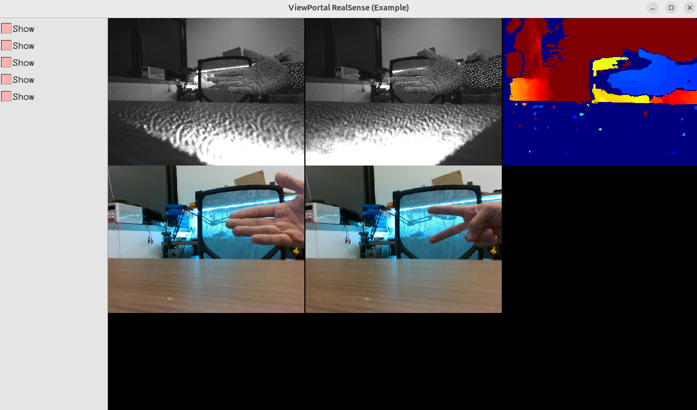

# ViewPortal

Multi-viewport display library using Pangolin. Define a grid of viewports (RGB8, G8, colored depth, reconstruction, plot), push frame data from your pipeline, and build custom GUIs without touching Pangolin or OpenGL directly.



## Building standalone

```bash
mkdir build && cd build
cmake ..
cmake --build .
```

This builds only the **viewportal** library. For runnable demos, use the standalone example projects under **examples/**.

## Using ViewPortal in your project (FetchContent)

From your project's `CMakeLists.txt`:

```cmake
include(FetchContent)
FetchContent_Declare(
  ViewPortal
  GIT_REPOSITORY https://github.com/YOUR_ORG/ViewPortal.git
  GIT_TAG        v1.0.0
)
FetchContent_MakeAvailable(ViewPortal)

# Your executable that uses the library
add_executable(my_gui apps/my_gui.cpp)
target_link_libraries(my_gui PRIVATE viewportal)
# If your app uses OpenCV or RealSense, find and link them as well:
find_package(OpenCV REQUIRED)
target_link_libraries(my_gui PRIVATE ${OpenCV_LIBS})
target_include_directories(my_gui PRIVATE ${OpenCV_INCLUDE_DIRS})
```

When added via FetchContent, only the **viewportal** library target is built (the example apps are skipped). Your app should:

1. Include `viewportal.h` (and optionally `viewportal_params.h`).
2. Create a `ViewPortal(rows, cols, types, params)` with your viewport types (e.g. `ViewportType::G8`, `ViewportType::RGB8`, `ViewportType::ColoredDepth`).
3. In your main loop, call `portal.updateFrame(index, frame_data)` for each image viewport and `portal.shouldQuit()` to exit.

**Minimal example — visualize one image (runnable as-is; link with ViewPortal and Pangolin):**

```cpp
#include "viewportal.h"
#include <vector>

int main() {
    const int w = 640, h = 480;
    std::vector<unsigned char> rgb(w * h * 3);
    for (int y = 0; y < h; ++y)
        for (int x = 0; x < w; ++x) {
            rgb[(y * w + x) * 3 + 0] = (unsigned char)(255 * x / w);  // R
            rgb[(y * w + x) * 3 + 1] = (unsigned char)(255 * y / h);  // G
            rgb[(y * w + x) * 3 + 2] = 128;                           // B
        }

    viewportal::ViewPortal portal(1, 1, {viewportal::ViewportType::RGB8}, "My image");
    viewportal::FrameData frame{w, h, viewportal::ImageFormat::RGB8, rgb.data(), 0};

    while (!portal.shouldQuit())
        portal.updateFrame(0, frame);

    return 0;
}
```
This draws a red–green gradient. For grayscale, use `ViewportType::G8`, `ImageFormat::Luminance8`, and a single byte per pixel.

**Standalone example projects** (each is its own CMake project that FetchContent-pulls ViewPortal; the main repo does not reference them):

- **examples/realsense/** — RealSense D435: five viewports (IR, IR, colored depth, color, snapshot). Build: `cd examples/realsense && cmake -B build -S . && cmake --build build`
- **examples/viewportal_sample/** — 2×2 grid (RGB8, G8, Reconstruction, Plot) with camera or synthetic frames. Build: `cd examples/viewportal_sample && cmake -B build -S . && cmake --build build`

When built from inside the ViewPortal repo, each example uses the local ViewPortal source; otherwise it fetches from the declared `GIT_REPOSITORY`.

## Dependencies

- **ViewPortal library:** only **Pangolin** (found via `find_package` or fetched automatically). The library has no OpenCV dependency.
- **Example apps** (in `examples/`): **OpenCV**; **examples/realsense** also requires **librealsense2**.
